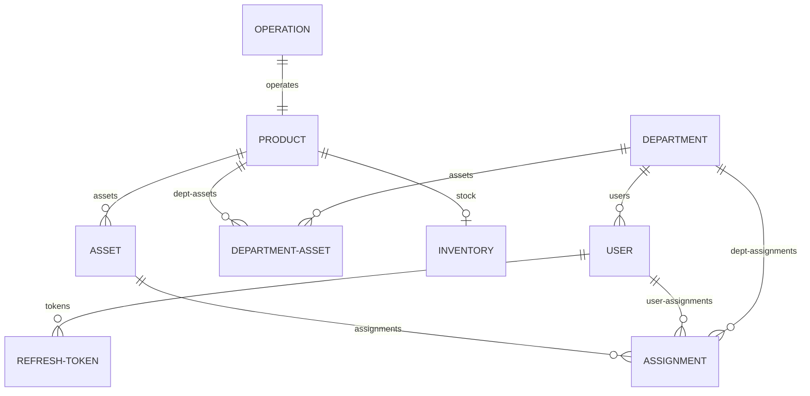

# 📄 Ombor Boshqaruv Tizimi (WMS) — Backend Asosiy Hujjati (README.md)
> **Loyiha turi:** NestJS (Backend) + Prisma ORM + PostgreSQL  
> **API Endpointlar soni:** Jami 52 ta  
> **Qo'llanma maqsadi:** Loyihaning tizim arxitekturasi, ma'lumotlar bazasi sxemasi, biznes qoidalari, ko'p tillilik sozlamalari, barcha API-lar ro'yxati va ishga tushirish yo'riqnomalarini bitta yagona faylda jamlash.

---

## 📌 1. LOYIHA HAQIDA UMUMIY TAVSIF
Ushbu loyiha ombor zaxiralari, materiallar aylanishi, xodimlarning zimmalaridagi moddiy javobgarlik (jihozlar) va tizimdagi barcha operatsiyalar tarixini real vaqtda kuzatish va boshqarish uchun mo'ljallangan Senior darajadagi backend tizimidir.

---

## 🛠️ 2. TEXNOLOGIYALAR TO'PLAMI (TECH STACK)
* **Freymvork:** NestJS (v11.x)
* **Ma'lumotlar bazasi ORM:** Prisma ORM (PostgreSQL bazasi bilan)
* **Xavfsizlik & Autentifikatsiya:** Passport.js (JWT va Local strategiyalar), bcrypt
* **Ko'p tillilik (i18n):** `nestjs-i18n` moduli orqali error va PDF tarjimalari.
* **Hujjatlar generatsiyasi:** Puppeteer yordamida dinamik PDF aktlarni yuklab olish.
* **Hujjatlashtirish:** Swagger UI (`/docs` manzilida)
* **Boshqa paketlar:** `nodemailer`, `class-validator`, `class-transformer`

---

## 📂 3. LOYIHA TUZILISHI (PROJECT STRUCTURE)
Loyiha modulli arxitekturaga ega:
* [src/app.module.ts](file:///C:/Users/User/Desktop/work/loyha/back/src/app.module.ts) — Asosiy modul (barcha feature modullarini, shu jumladan `MailModule` va `I18nModule`ni global bog'laydi).
* [src/main.ts](file:///C:/Users/User/Desktop/work/loyha/back/src/main.ts) — Ilovani ishga tushirish fayli (API prefiksi: `api/v1`, global filterlar, interceptorlar va global pipe).
* [src/common/](file:///C:/Users/User/Desktop/work/loyha/back/src/common) — Umumiy yordamchi modullar, helperlar (shu jumladan `i18n.helper.ts`), filterlar va interceptorlar.
* [src/modules/](file:///C:/Users/User/Desktop/work/loyha/back/src/modules) — Biznes mantiq modullari:
  * **auth**: Login, logout, refresh token rotation (O(1) tokenId tizimi) hamda default foydalanuvchilar seeding xizmati.
  * **users**: Xodimlar boshqaruvi, statuslarni o'zgartirish, token bekor qilish, jihozlar ro'yxati va **Excel eksporti**.
  * **departments**: Bo'limlar boshqaruvi, xodimlar va shared jihozlar ro'yxati hamda **Excel eksporti**.
  * **products**: Mahsulotlar katalogini boshqarish (omborda yoki bo'limda qoldiq bo'lsa o'chirishni taqiqlovchi xavfsiz soft delete).
  * **inventory**: Ombor qoldiqlari, minimal darajalar, ommaviy Excel kirim qilish hamda zaxirani UTF-8 BOM bilan CSV eksport qilish.
  * **operations**: Kirim (Stock In), Xodimga berish/qaytarish, Bo'limga material berish/qaytarish, Bo'limga umumiy jihoz biriktirish (`ASSIGN_TO_DEPT`) va qaytarish (`RETURN_FROM_DEPT`), hamda hisobdan chiqarish (Write-off). Barcha operatsiyalar Prisma tranzaksiyalari orqali himoyalangan.
  * **stats**: Dashboard ko'rsatkichlari, oylik dinamika, bo'lim va xodimlar yuklamasi hamda oylik o'sish dinamikasi solishtirish (Bu oy vs O'tgan oy).
  * **history**: Harakatlar tarixi arxivi (Rol cheklovlari, jihoz bo'yicha qidirish va CSV audit eksport).
  * **nodemailer (mail)**: Kam qolgan tovarlar uchun avtomatik HTML formatidagi email ogohlantirish xizmati.

---

## 🗄️ 4. MA'LUMOTLAR BAZASI SXEMASI (DATABASE SCHEMA)
Ma'lumotlar sxemasi [prisma/schema.prisma](file:///C:/Users/User/Desktop/work/loyha/back/prisma/schema.prisma) faylida tasvirlangan. Asosiy aloqalar quyidagicha:



### 4.1. Mahsulot Turlari (ProductType)
* **BERILADIGAN:** Har bir dona alohida inventar raqami bilan jismoniy kuzatiladigan jihozlar (noutbuk, printer, monitor). Ular xodimlarga yoki bo'limga umumiy foydalanishga (`Assignment`) biriktiriladi.
* **SARFLANADIGAN:** Umumiy miqdorda o'lchanadigan materiallar (qog'oz, ruchka, batareya). Ular bo'limlarga (`DepartmentAsset`) o'tkaziladi va qaytarilmaydi.

### 4.2. Operatsiyalar Turlari (OperationType)
* `STOCK_IN` — Omborga kirim qilish.
* `GIVE_TO_DEPT` — Bo'limga sarflanadigan material berish.
* `RETURN_FROM_DEPT` — Bo'limdan material yoki umumiy jihozni omborga qaytarish.
* `GIVE_TO_USER` — Xodimga jihoz biriktirish.
* `RETURN_FROM_USER` — Xodimdan jihozni omborga qaytarib olish.
* `TRANSFER_USER` — Jihozni bir xodimdan boshqasiga o'tkazish.
* `ASSIGN_TO_DEPT` — Ombordan bo'limga umumiy foydalanish uchun jihoz biriktirish (Shared Asset).
* `WRITE_OFF` — Jihoz yoki materialni hisobdan chiqarish (utilizatsiya).

---

## 🔒 5. ROLLAR VA RUXSATLAR MATRITSA-JADVALI

| Endpoint | ADMIN | OMBORCHI | KADR | XODIM |
| :--- | :---: | :---: | :---: | :---: |
| `POST /auth/login` | ✅ | ✅ | ✅ | ✅ |
| `GET /auth/me` | ✅ | ✅ | ✅ | ✅ |
| `GET /departments` | ✅ | ✅ | ✅ | ❌ |
| `GET /departments/export` | ✅ | ✅ | ✅ | ❌ |
| `POST /departments` | ✅ | ❌ | ❌ | ❌ |
| `GET /users` | ✅ | ❌ | ✅ | ❌ |
| `GET /users/export` | ✅ | ❌ | ✅ | ❌ |
| `GET /users/:id/assignments` | ✅ | ✅ | ✅ | ❌ |
| `PATCH /users/:id/status` | ✅ | ❌ | ❌ | ❌ |
| `GET /products` | ✅ | ✅ | ✅ | ✅ |
| `POST /products` | ❌ | ❌ | ❌ | ❌ |
| `GET /inventory` | ✅ | ✅ | ✅ | ❌ |
| `GET /inventory/export` | ✅ | ✅ | ✅ | ❌ |
| `POST /inventory/bulk-stock-in` | ✅ | ✅ | ❌ | ❌ |
| `POST /operations/*` | ✅ | ✅ | ❌ | ❌ |
| `POST /operations/write-off` | ✅ | ❌ | ❌ | ❌ |
| `GET /operations/:id/pdf` | ✅ | ✅ | ✅ | ❌ |
| `GET /history` | ✅ | ✅ | ✅ | ❌ |
| `GET /history/export` | ✅ | ✅ | ✅ | ❌ |
| `GET /stats/*` | ✅ | ✅ | ❌ | ❌ |

---

## ⚡ 6. MUHIM BIZNES QOIDALARI

1. **Mahsulot Yaratish:** Alohida `POST /products` API mavjud emas. Mahsulotlar katalogga faqat birinchi marta `STOCK_IN` operatsiyasi bajarilganda avtomatik ravishda qo'shiladi.
2. **Jihozlar (`BERILADIGAN`):** Har bir jismoniy jihoz alohida `Asset` sifatida bazada saqlanadi. Kirim qilinayotgan vaqtda inventar raqamlari massivi taqdim etiladi va bitta tranzaksiya ichida jihozlar avtomatik yaratiladi.
3. **Materiallar (`SARFLANADIGAN`):** Ular bo'limlarga miqdor ko'rinishida beriladi va qaytarib olinmaydi. Zaxirasi faqat son jihatdan kuzatiladi.
4. **Soft Delete (Xavfsiz O'chirish):** Hech bir ma'lumot bazadan butunlay o'chib ketmaydi, faqat `deletedAt` vaqti belgilanadi.
5. **O'chirish cheklovlari:**
   * Omborda yoki bo'limlarda qoldig'i bor mahsulotni o'chirib bo'lmaydi.
   * Xodimlari yoki faol jihozlari mavjud bo'limni o'chirib bo'lmaydi.
6. **Bloklash:** Foydalanuvchi bloklanganda, uning barcha faol `RefreshToken`lari darhol bekor qilinadi.

---

## 🌐 7. OXIRGI KIRITILGAN FUNKSIONALIKLAR

### A. Ko'p tillilik (i18n)
* **Tilni aniqlash:** So'rov sarlavhasidagi `Accept-Language` (uz, ru, en) yoki URL-dagi `?lang=...` query parametri orqali amalga oshiriladi.
* **Helper:** Tizim xatoliklarini oson tarjima qilish uchun global `t()` yordamchi helper funksiyasi yozilgan.
* **Tarjima shablonlari:** [src/i18n/](file:///C:/Users/User/Desktop/work/loyha/back/src/i18n) papkasida joylashgan:
  * `errors.json` ➡️ Validation va API xatoliklari.
  * `pdf.json` ➡️ Qabul-topshirish dalolatnomalari (PDF) shablon matnlari.

### B. Excel eksport tizimi
* **Ombor hisoboti (`GET /inventory/export`):** Zaxira holati.
* **Harakatlar tarixi (`GET /history/export`):** Tarixni filtrlash orqali eksport qilish.
* **Xodimlar eksporti (`GET /users/export`):** Xodimlar ma'lumotlari, lavozimlari va biriktirilgan jihozlar soni.
* **Bo'limlar eksporti (`GET /departments/export`):** Bo'lim xodimlar soni va moddiy yuklamasi.

---

## 🚀 8. API ENDPOINTLAR RO'YXATI (Jami: 52 ta)

### 8.1. AUTH Moduli (5 ta)
* `POST /auth/login` `[ALL]` — Tizimga kirish.
* `POST /auth/refresh` `[ALL]` — Token yangilash.
* `POST /auth/logout` `[ALL]` — Tizimdan chiqish.
* `GET /auth/me` `[ALL]` — Joriy foydalanuvchi profili.
* `PUT /auth/change-password` `[ALL]` — Parolni o'zgartirish.

### 8.2. DEPARTMENTS Moduli (7 ta)
* `GET /departments` `[A, AO, K]` — Barcha bo'limlar ro'yxati.
* `GET /departments/export` `[A, AO, K]` — Bo'limlarni Excelga eksport qilish.
* `GET /departments/:id` `[A, AO, K]` — Bitta bo'lim tafsilotlari.
* `GET /departments/:id/stats` `[AO]` — Bo'lim statistikasi.
* `POST /departments` `[A]` — Yangi bo'lim qo'shish.
* `PUT /departments/:id` `[A]` — Bo'limni tahrirlash.
* `DELETE /departments/:id` `[A]` — Bo'limni o'chirish.

### 8.3. USERS Moduli (11 ta)
* `GET /users` `[A, K]` — Barcha xodimlar ro'yxati.
* `GET /users/export` `[A, K]` — Xodimlarni Excelga eksport qilish.
* `GET /users/:id` `[A, K]` — Bitta xodim ma'lumoti.
* `GET /users/:id/assignments` `[A, AO, K]` — Xodimning jihozlari.
* `GET /users/:id/history` `[A, AO, K]` — Xodimning amallar tarixi.
* `POST /users` `[A]` — Yangi xodim qo'shish.
* `PUT /users/:id` `[A]` — Xodim ma'lumotlarini tahrirlash.
* `PATCH /users/:id/status` `[A]` — Xodimni bloklash / faollashtirish.
* `DELETE /users/:id` `[A]` — Xodimni o'chirish (soft delete).
* `POST /users/:id/bulk-return` `[A, AO]` — Barcha jihozlarni qaytarish.
* `POST /users/:id/bulk-transfer` `[A, AO]` — Barcha jihozlarni boshqa xodimga o'tkazish.

### 8.4. PRODUCTS Moduli (6 ta)
* `GET /products` `[ALL]` — Mahsulotlar katalogi.
* `GET /products/low-stock` `[A, AO]` — Kam qolgan mahsulotlar.
* `GET /products/:id` `[ALL]` — Bitta mahsulot tafsilotlari.
* `GET /products/:id/history` `[A, AO]` — Mahsulot harakatlari tarixi.
* `PUT /products/:id` `[A]` — Mahsulotni tahrirlash.
* `DELETE /products/:id` `[A]` — Mahsulotni katalogdan o'chirish.

### 8.5. INVENTORY Moduli (6 ta)
* `GET /inventory` `[A, AO, K]` — Barcha ombor qoldiqlari holati.
* `GET /inventory/low-stock` `[A, AO]` — Minimal ogohlantirish qoldiqlari.
* `GET /inventory/export` `[A, AO, K]` — Ombor hisobotini Excelga yuklash.
* `GET /inventory/:productId` `[A, AO, K]` — Bitta mahsulot ombor qoldig'i.
* `PATCH /inventory/min-level` `[A, AO]` — Minimal daraja belgilash.
* `POST /inventory/bulk-stock-in` `[A, AO]` — Excel orqali bir vaqtda ko'p mahsulot kirim qilish.

### 8.6. OPERATIONS Moduli (9 ta)
* `POST /operations/stock-in` `[A, AO]` — Yakka tartibda kirim qilish.
* `POST /operations/give-to-user` `[A, AO]` — Xodimga jihoz berish.
* `POST /operations/return-from-user` `[A, AO]` — Xodimdan jihozni qaytarib olish.
* `POST /operations/transfer-user` `[A, AO]` — Jihozni bir xodimdan boshqasiga o'tkazish.
* `POST /operations/give-to-dept` `[A, AO]` — Bo'limga material topshirish.
* `POST /operations/assign-to-dept` `[A, AO]` — Bo'limga umumiy foydalanish uchun jihoz biriktirish.
* `POST /operations/return-from-dept` `[A, AO]` — Bo'limdan material yoki jihozni qaytarish.
* `POST /operations/write-off` `[A]` — Jihoz yoki materialni hisobdan chiqarish.
* `GET /operations/:id/pdf` `[A, AO, K]` — Operatsiya qabul-topshirish dalolatnomasini (PDF) yuklab olish.

### 8.7. HISTORY Moduli (2 ta)
* `GET /history` `[A, AO, K]` — Barcha operatsiyalar tarixi.
* `GET /history/export` `[A, AO, K]` — Tarixni CSV formatida eksport qilish.

### 8.8. STATS Moduli (6 ta)
* `GET /stats/overview` `[A, AO]` — Umumiy dashboard ko'rsatkichlari.
* `GET /stats/by-department` `[A, AO]` — Bo'limlar kesimida jihozlar yuklamasi va qiymati.
* `GET /stats/by-product` `[A, AO]` — Mahsulotlar bo'yicha chiqarilgan qoldiqlar.
* `GET /stats/by-user` `[A, AO]` — Xodimlar kesimida yuklama va qiymat.
* `GET /stats/monthly` `[A, AO]` — Oylik dinamika.
* `GET /stats/comparison` `[A, AO]` — Oyma-oy solishtirish (Bu oy vs O'tgan oy foizlarda).

---

## 🎛️ 9. TIZIM SOZLAMALARI (ENVIRONMENT VARIABLES)
Loyihani sozlash uchun `.env` faylida quyidagi o'zgaruvchilardan foydalaniladi:

| O'zgaruvchi | Turi | Standart Qiymat | Tavsif |
| :--- | :---: | :--- | :--- |
| `APP_PORT` | `number` | `4000` | NestJS ilovasi eshitadigan port. |
| `DATABASE_URL` | `string` | `postgresql://...` | PostgreSQL ulanish satri (Prisma orqali). |
| `JWT_SECRET` | `string` | `"your-secret"` | Access JWT token imzo kaliti. |
| `JWT_REFRESH_SECRET`| `string` | `"your-secret"` | Refresh JWT token imzo kaliti. |
| `MAIL_USER` | `string` | `""` | Nodemailer SMTP foydalanuvchi emaili. |
| `MAIL_PASSWORD` | `string` | `""` | Gmail App Password (SMTP maxsus parol). |
| `ALLOWED_ORIGINS` | `string` | `http://localhost:5173` | CORS ruxsat etilgan frontend domenlari. |

---

## 🐳 10. DOCKER ORQALI ISHGA TUSHIRISH
Loyiha to'liq Docker-ready holatiga keltirilgan.
1. **Ishga tushirish:**
   ```bash
   docker-compose up -d --build
   ```
2. **Konteynerlar holatini tekshirish:**
   ```bash
   docker-compose ps
   ```

---

## 🧪 11. TESTLASH (TESTING GUIDE)
* **Barcha unit testlarni ishga tushirish:**
  ```bash
  npm run test
  ```
* **Test qamrovini tekshirish:**
  ```bash
  npm run test:cov
  ```
* **E2E integratsiya testlarini boshlash:**
  ```bash
  npm run test:e2e
  ```

---

## 🚀 12. ISHGA TUSHIRISH YO'RIQNOMASI (STARTUP GUIDE)
1. **Kutubxonalarni o'rnatish:**
   ```bash
   npm install
   ```
2. **Ma'lumotlar bazasini yangilash va migratsiya qilish:**
   ```bash
   npx prisma migrate dev
   ```
3. **Baza uchun dastlabki foydalanuvchilarni seeding qilish:**
   ```bash
   npx prisma db seed
   ```
4. **Lokal ishga tushirish:**
   ```bash
   npm run dev
   ```
