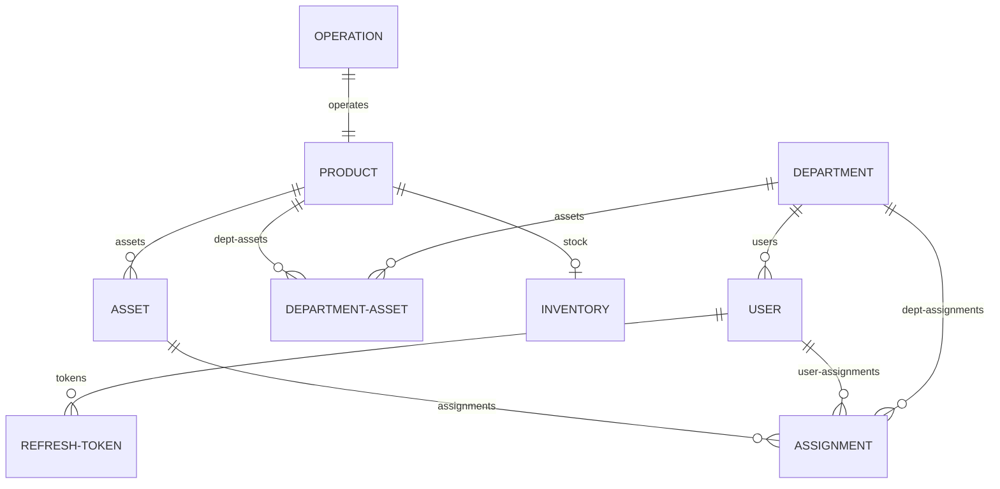

# Ombor Boshqaruv Tizimi (Warehouse Management System) - Backend Tavsifi & Qo'llanmasi

Ushbu loyiha ombor zaxiralari, jihozlar, xodimlar va bo'limlar o'rtasidagi barcha operatsiyalarni boshqarish uchun mo'ljallangan **NestJS** va **Prisma ORM** (PostgreSQL) asosidagi Senior darajadagi backend tizimidir.

---

## 🛠️ Texnologiyalar To'plami (Tech Stack)

* **Freymvork:** NestJS (v11.x)
* **Ma'lumotlar bazasi ORM:** Prisma ORM (PostgreSQL bazasi bilan)
* **Xavfsizlik & Autentifikatsiya:** Passport.js (JWT va Local strategiyalar), bcrypt
* **Hujjatlashtirish:** Swagger UI (`/docs` manzilida)
* **Boshqa paketlar:** `nodemailer`, `class-validator`, `class-transformer`

---

## 📂 Loyiha Tuzilishi (Project Structure)

Loyiha modulli arxitekturaga ega:
* [src/app.module.ts](file:///C:/Users/User/Desktop/work/loyha/back/src/app.module.ts) — Asosiy modul (barcha feature modullarini, shu jumladan `MailModule`ni global bog'laydi).
* [src/main.ts](file:///C:/Users/User/Desktop/work/loyha/back/src/main.ts) — Ilovani ishga tushirish fayli (API prefiksi: `api/v1`, global filterlar va interceptorlar).
* [src/modules/](file:///C:/Users/User/Desktop/work/loyha/back/src/modules) — Biznes mantiq modullari:
  * **auth**: Login, logout, refresh token rotation (CPU DoS va xotira bloatidan himoyalangan O(1) tokenId tizimi) hamda bootstrap vaqtida default foydalanuvchilar seeding xizmati.
  * **users**: Xodimlar boshqaruvi, statuslarni o'zgartirish, tranzaksion token bekor qilish va biriktirilgan jihozlar ro'yxati.
  * **departments**: Tashkilot bo'limlarini boshqarish (bo'lim nomi takrorlanmasligi tekshiruvi, xodimlar va shared jihozlar ro'yxati).
  * **products**: Mahsulotlar katalogini boshqarish (omborda yoki bo'limda qoldiq bo'lsa o'chirishni taqiqlovchi xavfsiz soft delete).
  * **inventory**: Ombor qoldiqlari, minimal darajalar, ommaviy Excel kirim qilish hamda zaxirani UTF-8 BOM bilan CSV eksport qilish.
  * **operations**: Kirim (Stock In), Xodimga berish/qaytarish, Bo'limga material berish/qaytarish, Bo'limga umumiy jihoz biriktirish (`ASSIGN_TO_DEPT`) va qaytarish (`RETURN_FROM_DEPT`), hamda hisobdan chiqarish (Write-off). Barcha operatsiyalar Prisma tranzaksiyalari orqali himoyalangan.
  * **stats**: Dashboard ko'rsatkichlari, oylik dinamika, bo'lim va xodimlar yuklamasi hamda oylik o'sish dinamikasi solishtirish (Bu oy vs O'tgan oy).
  * **history**: Harakatlar tarixi arxivi (Rol cheklovlari, jihoz bo'yicha qidirish va CSV audit eksport).
  * **nodemailer (mail)**: Kam qolgan tovarlar uchun avtomatik HTML formatidagi email ogohlantirish xizmati.

---

## 🗄️ Ma'lumotlar Bazasi Sxemasi (Database Schema)

Ma'lumotlar sxemasi [prisma/schema.prisma](file:///C:/Users/User/Desktop/work/loyha/back/prisma/schema.prisma) faylida tasvirlangan. Asosiy aloqalar quyidagicha:



### 1. Mahsulot Turlari (ProductType)
* **BERILADIGAN:** Har bir dona alohida inventar raqami bilan jismoniy kuzatiladigan jihozlar (noutbuk, printer, monitor). Ular xodimlarga yoki bo'limga umumiy foydalanishga (`Assignment`) biriktiriladi.
* **SARFLANADIGAN:** Umumiy miqdorda o'lchanadigan materiallar (qog'oz, ruchka, batareya). Ular bo'limlarga (`DepartmentAsset`) o'tkaziladi va qaytarilmaydi (yoki qoldiq qaytariladi).

### 2. Operatsiyalar Turlari (OperationType)
* `STOCK_IN` — Omborga kirim qilish.
* `GIVE_TO_DEPT` — Bo'limga sarflanadigan material berish.
* `RETURN_FROM_DEPT` — Bo'limdan material yoki umumiy jihozni omborga qaytarish.
* `GIVE_TO_USER` — Xodimga jihoz biriktirish.
* `RETURN_FROM_USER` — Xodimdan jihozni omborga qaytarib olish.
* `TRANSFER_USER` — Jihozni bir xodimdan boshqasiga o'tkazish.
* `ASSIGN_TO_DEPT` — Ombordan bo'limga umumiy foydalanish uchun jihoz biriktirish.
* `WRITE_OFF` — Jihoz yoki materialni hisobdan chiqarish (utilizatsiya).

---

## 🔧 Amalga Oshirilgan Senior Yaxshilanishlar (Senior Improvements)

1. **Refresh Token Rotation (DoS Himoyasi):**
   * bcrypt solishtirishdagi loop orqali yuzaga keladigan CPU DoS zaifligi bartaraf etildi. JWT refresh tokeniga `tokenId` bog'lanib, bazadan qidirish tezligi O(1) ga tushirildi. Tokenlar muddati tugashi bilan avtomatik tarzda tozalanadi.
2. **Kadr (`KADR`) Roli Qo'shildi:**
   * Tizimga Kadrlar bo'limi xodimi (`KADR`) roli kiritildi. Ularga faqat o'qish (GET) huquqi berildi va xodimlar qarzdorligini (bo'shash arizasida jihozlarni tekshirish uchun) kuzatish imkoniyati yaratildi.
3. **Avtomatik Jihoz Yaratish (Eager Asset Creation - Kirimda):**
   * Jihozlar kirim qilinayotgan vaqtda (`stock-in` va `bulk-stock-in` operatsiyalarida) inventar va seriya raqamlari massivi orqali barcha `Asset` obyektlari bitta tranzaksiya ichida avtomatik ravishda yaratiladi.
4. **Bo'lim Umumiy Jihozlari (Shared Assets - F-07):**
   * Printer va skaner kabi jihozlarni bo'limga biriktirish (`ASSIGN_TO_DEPT`) va qaytarish (`RETURN_FROM_DEPT`) to'liq integratsiya qilindi.
5. **Mahsulot O'chirishdagi Xavfsizlik:**
   * Mahsulot katalogini o'chirishda omborda (`Inventory.quantity > 0`) yoki bo'limlarda (`DepartmentAsset.quantity > 0`) zaxira qoldig'i mavjud bo'lsa, tizim o'chirishni taqiqlaydigan qilindi.
6. **Eksport Tizimi (Excel/CSV Reports):**
   * Amallar tarixi va Ombor zaxiralari / Biriktirilgan jihozlar holatini Excelda to'g'ri ochilishi uchun UTF-8 BOM (`\ufeff`) bilan CSV formatida yuklab olish endpointlari yaratildi.
7. **Email Ogohlantirish Tizimi (Nodemailer):**
   * `MailModule` tizimga to'liq ulandi. Ombordagi mahsulot miqdori minimal belgilangan darajadan (`minLevel`) kamayib ketganda, tizim orqa fonda (asinxron) mas'ul omborchiga chiroyli HTML ogohlantirish xatini yuboradi.
8. **Statistika va Tahliliy Ko'rsatkichlar (Real-Time Stats):**
   * Ombor qiymati real-vaqtda joriy zaxira bo'yicha hisoblanadi. Oyma-oy solishtirish (foiz ko'rsatkichlarida) va bo'limlarning umumiy foydalanayotgan jihozlari qiymati (`totalAssetValue`) qo'shildi.

---

## 🚀 API Endpointlar Ro'yxati (Jami: 49 ta)

Base URL: `/api/v1`

Rol belgilari:
* `[A]`  = faqat ADMIN
* `[AO]` = ADMIN + OMBORCHI
* `[K]`  = KADR (HR)
* `[X]`  = XODIM
* `[ALL]` = Barcha (ADMIN + OMBORCHI + KADR + XODIM)

### 1. AUTH Moduli (5 ta)
* `POST /auth/login` `[ALL]` — Tizimga kirish.
* `POST /auth/refresh` `[ALL]` — Token yangilash.
* `POST /auth/logout` `[ALL]` — Tizimdan chiqish (ref token o'chiriladi).
* `GET /auth/me` `[ALL]` — Joriy foydalanuvchi profili.
* `PUT /auth/change-password` `[ALL]` — Parolni o'zgartirish.

### 2. DEPARTMENTS Moduli (6 ta)
* `GET /departments` `[A, AO, K]` — Barcha bo'limlar ro'yxati.
* `GET /departments/:id` `[A, AO, K]` — Bitta bo'lim tafsilotlari (shu jumladan xodimlar ro'yxati, sarflanadigan materiallar va shared jihozlar ro'yxati).
* `GET /departments/:id/stats` `[AO]` — Bo'lim statistikasi.
* `POST /departments` `[A]` — Yangi bo'lim qo'shish (nom takrorlanishi taqiqlanadi).
* `PUT /departments/:id` `[A]` — Bo'limni tahrirlash.
* `DELETE /departments/:id` `[A]` — Bo'limni o'chirish (agar unda xodim yoki jihoz bo'lmasa).

### 3. USERS Moduli (9 ta)
* `GET /users` `[A, K]` — Barcha xodimlar ro'yxati (qidiruv, bo'lim bo'yicha filtr).
* `GET /users/:id` `[A, K]` — Bitta xodim ma'lumoti.
* `GET /users/:id/assignments` `[A, AO, K]` — Xodimning hozirda mavjud barcha faol jihozlari.
* `GET /users/:id/history` `[A, AO, K]` — Xodimning amallar tarixi.
* `POST /users` `[A]` — Yangi xodim qo'shish.
* `PUT /users/:id` `[A]` — Xodim ma'lumotlarini tahrirlash.
* `PATCH /users/:id/status` `[A]` — Xodimni bloklash / faollashtirish (bloklanganda uning barcha tokenlari darhol o'chadi).
* `DELETE /users/:id` `[A]` — Xodimni tizimdan o'chirish (soft delete).
* `POST /users/:id/bulk-return` `[A, AO]` — Xodimdan barcha jihozlarni bitta so'rovda qaytarib olish.
* `POST /users/:id/bulk-transfer` `[A, AO]` — Xodimning barcha jihozlarini boshqa xodimga o'tkazish.

### 4. PRODUCTS Moduli (7 ta)
* `GET /products` `[ALL]` — Mahsulotlar katalogi (qidiruv, tur bo'yicha filtr).
* `GET /products/low-stock` `[A, AO]` — Kam qolgan mahsulotlar ro'yxati.
* `GET /products/:id` `[ALL]` — Bitta mahsulot tafsilotlari.
* `GET /products/:id/history` `[A, AO]` — Mahsulot harakatlari tarixi.
* `POST /products` `[A]` — Yangi mahsulot yaratish.
* `PUT /products/:id` `[A]` — Mahsulotni tahrirlash.
* `DELETE /products/:id` `[A]` — Mahsulotni katalogdan o'chirish (qoldiqlar bo'lsa taqiqlanadi).

### 5. INVENTORY Moduli (6 ta)
* `GET /inventory` `[A, AO, K]` — Barcha ombor qoldiqlari holati.
* `GET /inventory/low-stock` `[A, AO]` — Minimal ogohlantirish qoldiqlari.
* `GET /inventory/export` `[A, AO, K]` — Ombor joriy qoldig'i va jihozlar biriktiruvini Excel (CSV) formatida yuklab olish.
* `GET /inventory/:productId` `[A, AO, K]` — Bitta mahsulot ombor qoldig'i.
* `PATCH /inventory/min-level` `[A, AO]` — Minimal ogohlantirish darajasini belgilash.
* `POST /inventory/bulk-stock-in` `[A, AO]` — Excel orqali bir vaqtda ko'p mahsulot kirim qilish.

### 6. OPERATIONS Moduli (7 ta)
* `POST /operations/stock-in` `[A, AO]` — Yakka tartibda kirim qilish (jihoz bo'lsa Asset avtomatik yaratiladi).
  * Body: `{ name, productType, unit, quantity, unitPrice, inventoryNumbers?, serialNumbers?, minLevel?, documentNumber?, note? }`
* `POST /operations/give-to-user` `[A, AO]` — Xodimga jihoz biriktirish.
  * Body: `{ userId, productId, inventoryNumber, serialNumber?, documentNumber?, note? }`
* `POST /operations/return-from-user` `[A, AO]` — Xodimdan jihozni omborga qaytarib olish.
  * Body: `{ userId, assetId, documentNumber?, note? }`
* `POST /operations/transfer-user` `[A, AO]` — Jihozni bir xodimdan boshqasiga o'tkazish.
  * Body: `{ fromUserId, toUserId, assetId, documentNumber?, note? }`
* `POST /operations/give-to-dept` `[A, AO]` — Bo'limga sarflanadigan material berish.
  * Body: `{ departmentId, productId, quantity, documentNumber?, note? }`
* `POST /operations/assign-to-dept` `[A, AO]` — Bo'limga umumiy foydalanish uchun jihoz biriktirish (Shared Asset).
  * Body: `{ departmentId, productId, inventoryNumber, serialNumber?, documentNumber?, note? }`
* `POST /operations/return-from-dept` `[A, AO]` — Bo'limdan material yoki umumiy jihozni omborga qaytarish.
  * Body: `{ departmentId, productId, quantity?, assetId?, documentNumber?, note? }`
* `POST /operations/write-off` `[A]` — Jihoz yoki materialni hisobdan chiqarish (spisanie).
  * Body: `{ productId?, assetId?, quantity?, documentNumber?, note? }`
* `GET /operations/:id/pdf` `[A, AO, K]` — Operatsiya qabul-topshirish dalolatnomasini (PDF) yuklab olish.

### 7. HISTORY Moduli (2 ta)
* `GET /history` `[A, AO, K]` — Filtrlar bo'yicha to'liq amallar tarixi.
  * Query: `?operationType=...&userId=...&departmentId=...&productId=...&assetId=...&inventoryNumber=...&from=...&to=...&page=1&limit=20`
* `GET /history/export` `[A, AO, K]` — Tarixni filtrlar bo'yicha CSV formatida eksport qilish.

### 8. STATS Moduli (6 ta)
* `GET /stats/overview` `[A, AO]` — Umumiy dashboard ko'rsatkichlari (Jami jihozlar qiymati, hisobdan o'chirish zararlari).
* `GET /stats/by-department` `[A, AO]` — Bo'limlar kesimida jihozlar yuklamasi va umumiy qiymati (`totalAssetValue`).
* `GET /stats/by-product` `[A, AO]` — Mahsulotlar bo'yicha jami chiqarilgan qoldiqlar statistikasi.
* `GET /stats/low-stock` `[A, AO]` — Kam qolgan mahsulotlar ro'yxati.
* `GET /stats/monthly` `[A, AO]` — Oylik dinamika.
* `GET /stats/comparison` `[A, AO]` — Oyma-oy solishtirish (Bu oy vs O'tgan oy o'sish foizlarida).

---

## 🔒 Rol Ruxsatlari Jadvali

| Endpoint | ADMIN | OMBORCHI | KADR | XODIM |
| :--- | :---: | :---: | :---: | :---: |
| `POST /auth/login` | ✅ | ✅ | ✅ | ✅ |
| `GET /auth/me` | ✅ | ✅ | ✅ | ✅ |
| `GET /departments` | ✅ | ✅ | ✅ | ❌ |
| `GET /departments/:id` | ✅ | ✅ | ✅ | ❌ |
| `POST /departments` | ✅ | ❌ | ❌ | ❌ |
| `GET /users` | ✅ | ❌ | ✅ | ❌ |
| `GET /users/:id/assignments` | ✅ | ✅ | ✅ | ❌ |
| `PATCH /users/:id/status` | ✅ | ❌ | ❌ | ❌ |
| `GET /products` | ✅ | ✅ | ✅ | ✅ |
| `POST /products` | ✅ | ❌ | ❌ | ❌ |
| `GET /inventory` | ✅ | ✅ | ✅ | ❌ |
| `GET /inventory/export` | ✅ | ✅ | ✅ | ❌ |
| `POST /inventory/bulk-stock-in` | ✅ | ✅ | ❌ | ❌ |
| `POST /operations/*` | ✅ | ✅ | ❌ | ❌ |
| `POST /operations/write-off` | ✅ | ❌ | ❌ | ❌ |
| `GET /operations/:id/pdf` | ✅ | ✅ | ✅ | ❌ |
| `GET /history` | ✅ | ✅ | ✅ | ❌ |
| `GET /history/export` | ✅ | ✅ | ✅ | ❌ |
| `GET /stats/*` | ✅ | ✅ | ❌ | ❌ |

---

## 🎛️ Tizim Sozlamalari (Environment Variables)

Loyihani sozlash uchun `.env` faylida quyidagi o'zgaruvchilardan foydalaniladi:

| O'zgaruvchi | Turi | Standart Qiymat | Tavsif |
| :--- | :---: | :--- | :--- |
| `APP_PORT` | `number` | `4000` | NestJS ilovasi eshitadigan port. |
| `DATABASE_URL` | `string` | `postgresql://...` | PostgreSQL bazasiga ulanish satri (Prisma orqali). |
| `JWT_SECRET` | `string` | `"your-secret"` | Access JWT tokenlarni imzolash uchun kalit. |
| `JWT_REFRESH_SECRET`| `string` | `"your-secret"` | Refresh JWT tokenlarni imzolash uchun kalit. |
| `MAIL_USER` | `string` | `""` | Nodemailer SMTP (Gmail) foydalanuvchi emaili. |
| `MAIL_PASSWORD` | `string` | `""` | Gmail App Password (SMTP shifrlangan maxsus parol). |
| `ALLOWED_ORIGINS` | `string` | `http://localhost:5173` | CORS ruxsat etilgan frontend domenlari ro'yxati. |

---

## 🐳 Docker & Konteynerlashtirish (Docker Deployment)

Loyiha to'liq Docker-ready holatiga keltirilgan. Bazani va backend ilovasini bir joyda ishga tushirish uchun Docker Compose dan foydalanish mumkin:

1. **Docker yordamida loyihani ishga tushirish:**
   ```bash
   docker-compose up -d --build
   ```
2. **Konteynerlar holatini tekshirish:**
   ```bash
   docker-compose ps
   ```
3. **Loglarni ko'rish:**
   ```bash
   docker-compose logs -f
   ```

---

## 🧪 Testlash (Testing Guide)

Tizimdagi biznes logikani testlash uchun unit va e2e testlar o'rin olgan:

* **Barcha unit testlarni ishga tushirish:**
  ```bash
  npm run test
  ```
* **Test qamrovini (test coverage) tekshirish:**
  ```bash
  npm run test:cov
  ```
* **End-to-End (E2E) integratsiya testlarini boshlash:**
  ```bash
  npm run test:e2e
  ```

---

## 📊 Foydali Boshqaruv Buyruqlari (Prisma CLI)

* **Prisma Studio (Bazada jadvallarni vizual ko'rish):**
  ```bash
  npx prisma studio
  ```
* **Yangi ma'lumotlar sxemasi o'zgarganda migratsiya yaratish:**
  ```bash
  npx prisma migrate dev --name <migration_nomi>
  ```
* **Bazani tozalash va qayta seed qilish:**
  ```bash
  npx prisma migrate reset
  ```

---

## 💼 PM2 yordamida Productionda ishga tushirish

Production muhitida Node.js ilovasining barqaror ishlashi va fon rejimida boshqarish uchun PM2 dan foydalanish tavsiya etiladi:

1. **Loyihani build qilish:**
   ```bash
   npm run build
   ```
2. **Ilovani PM2 orqali boshlash:**
   ```bash
   pm2 start dist/main.js --name "skladcontrol-backend"
   ```
3. **PM2 loglari va holati:**
   ```bash
   pm2 status
   pm2 logs "skladcontrol-backend"
   ```
